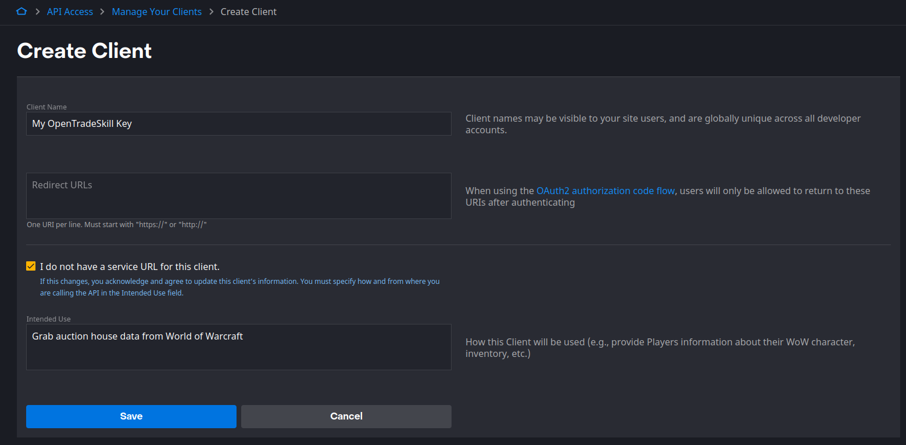
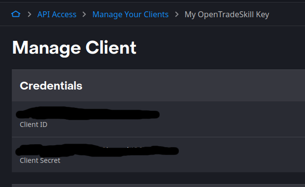

# Open Tradeskill Price Database

**WIP**: this is an incomplete setup. 

An open source price database for World of Warcraft auction house data, written in Bun JS.

## Installation
You will need to have `bun` installed, which you can find instructions of here: https://bun.sh/
```
git clone https://github.com/opentradeskill/price-db.git
bun install
mv .env.example .env
```

## Downloading (and maintaining) your price database
You will need to:
- Create a Battle.net developer account (https://develop.battle.net/access/)
- Download the `OpenTradeSkill_Pricing` addon
- Run the CLI download script

### Create a Battle.net developer account
- Create a developer account (https://develop.battle.net/)
- Create a new client (https://develop.battle.net/access/clients/create)

Enter the following:
- Client Name: `My OpenTradeSkill Key`
- Check "I do not have a service URL for this client."
- Intended Use: `Grab auction house data from World of Warcraft`



- Click Save

### Save your client ID and client secret


- Copy your Client ID and Client Secret
- Put them in your `.env` file (if you do not have one, move / copy `.env.example` to `.env`)

### Download the `OpenTradeSkill_Pricing` addon
https://github.com/opentradeskill/addon-pricing

Make a note of where your addon directory is, some example places may be:
- Windows: `C:/Program Files (x86)/World of Warcraft/_retail_/Interface/Addons/OpenTradeSkill_Pricing/`
- Mac: `/Applications/World of Warcraft/_retail_/Interface/Addons/OpenTradeSkill_Pricing/`
- Linux (via Lutris): `/home/<USERNAME>/Games/battlenet/drive_c/Program Files (x86)/World of Warcraft/_retail_/Interface/AddOns/OpenTradeSkill_Pricing/`

### Run the CLI download script
```
bun run cli/download --region [eu/us/kr/tw/cn] --realm "Realm Name" --outfile "/path/to/Addons/OpenTradeSkill_Pricing/PriceData.lua"
```

(If you're already in game in World of Warcraft, you will need to `/rl` to update your pricing)

The World of Warcraft auction data API updates every hour or so. Running more often than that would not be recommended.